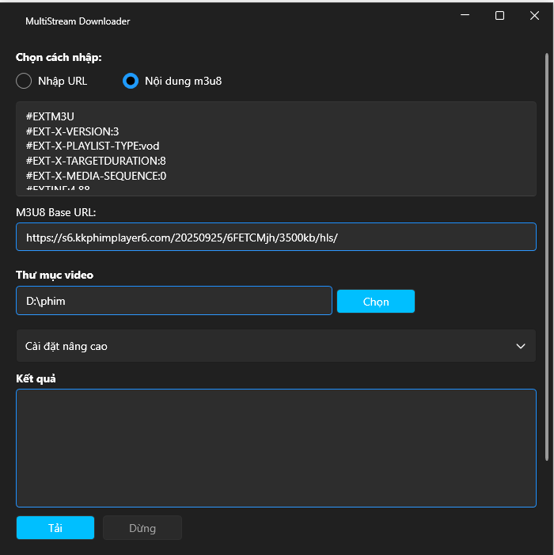

# M3U8 Downloader

Một ứng dụng desktop hiện đại trên Windows để tải các luồng video M3U8 với giao diện WPF trực quan.

  

## Có gì mới trong v1.2.0

- 📱 **Tăng cường tương thích MP4:** Video hiện đã được tối ưu hóa để phát trên iPhone/Android bằng cách sử dụng chuẩn màu `yuv420p` và codec H.264/AAC.
- 🏷️ **Bảo tồn đầy đủ Metadata:** Đã sửa lỗi thiếu thông tin độ dài, độ phân giải và tốc độ bit trong Windows Explorer.
- 🚀 **Kích hoạt Fast Start:** Video hiện hỗ trợ phát ngay lập tức (faststart) trên các thiết bị di động.
- 🛠️ **Tích hợp FFmpeg:** Hỗ trợ FFmpeg gốc để đảm bảo đóng gói (muxing) ổn định và sửa lỗi các phân đoạn video.
- 🔧 **Tự động sửa lỗi (Fixup):** Sử dụng `--fixup force` để tự động sửa chữa các phân đoạn video bị hỏng hoặc bị thiếu.

## Tính năng

- 🎥 Tải các luồng video và âm thanh định dạng M3U8/MP4/MP3/M4A/MKV.
- 🤖 **Hỗ trợ Animevietsub:** Tự động trích xuất liên kết và vượt qua anti-bot.
- 🖥️ Giao diện WPF hiện đại với khung WPF-UI.
- ⚡ Được xây dựng với .NET 8.0 để đạt hiệu suất tối ưu.
- 📦 File thực thi độc lập (Self-contained).
- 📝 Hỗ trợ tùy chỉnh tiêu đề (headers) và đường dẫn tải về.
- 📊 Theo dõi tiến độ tải về trong thời gian thực.

## Ảnh chụp màn hình

## Cài đặt & Thiết lập
1. Tải bản phát hành mới nhất từ trang [Releases](https://github.com/Akai1Shuichi/m3u8downloader/releases).
2. Giải nén tệp ZIP.
3. **Quan trọng:** Để kích hoạt đầy đủ khả năng tương thích MP4 và metadata, hãy đặt file `ffmpeg.exe` và `ffprobe.exe` vào trong thư mục `Tools/ffmpeg/`.
4. Chạy `m3u8Downloader.exe`.

## Cách sử dụng
1. Khởi chạy ứng dụng.
2. Dán URL M3U8 hoặc nội dung M3U8 thô của bạn vào ô nhập liệu.
3. Chọn định dạng ưu tiên (MP4, MKV, MP3, v.v.).
4. Nhấn nút tải về.

Để biết thêm chi tiết, xem thêm tại [Nhật ký thay đổi (Changelog)](CHANGELOG.md).
