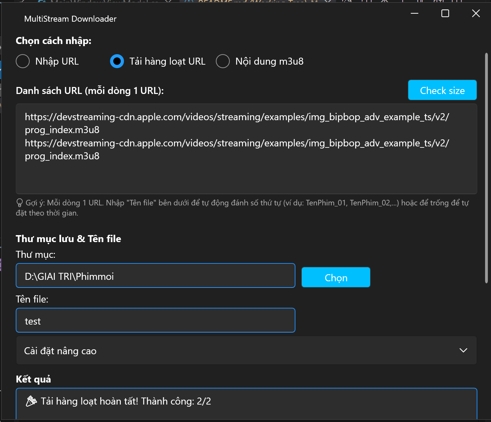

# M3U8 Downloader

Một ứng dụng desktop hiện đại trên Windows để tải các luồng video M3U8 với giao diện WPF trực quan.

  

## Có gì mới trong v1.4.0

- 🚀 **Tải hàng loạt URL (Batch Download):** Hỗ trợ nhập danh sách nhiều link (mỗi dòng 1 URL) để tải toàn bộ danh sách tập/bộ phim tự động.
- 🏷️ **Tự động đánh số thứ tự file:** Nhập tên phim (ví dụ: `TenPhim`), phần mềm tự động đặt tên theo từng tập (`TenPhim_01`, `TenPhim_02`,...).
- 📊 **Theo dõi tiến độ trực quan:** Hiển thị trạng thái chi tiết cho từng video `[1/N]` trong thời gian thực và tổng kết sau khi hoàn thành.
- ⏹️ **Quản lý hàng đợi tải & Dọn dẹp:** Dễ dàng dừng tải bất cứ lúc nào, tự động hủy hàng đợi và xóa các file tạm.
- 🌐 **Tối ưu Server nội bộ:** Tự động điều phối cổng kết nối tránh xung đột khi tải nhiều video liên tục.

## Tính năng

- 🎥 Tải các luồng video và âm thanh định dạng M3U8/MP4/MP3/M4A/MKV.
- 📋 **3 Chế độ nhập liệu:** Nhập 1 URL, Tải hàng loạt danh sách URL hoặc Nhập trực tiếp nội dung M3U8 thô.
- 🤖 **Hỗ trợ Animevietsub:** Tự động trích xuất liên kết và vượt qua anti-bot.
- 🖥️ Giao diện WPF hiện đại với khung WPF-UI.
- ⚡ Được xây dựng với .NET 8.0 để đạt hiệu suất tối ưu.
- 📦 File thực thi độc lập (Self-contained).
- 📝 Hỗ trợ tùy chỉnh tiêu đề (headers), số luồng chạy (`MaxWorker`) và đường dẫn lưu file.
- 📊 Theo dõi tiến độ tải về và kích thước file trong thời gian thực.

## Ảnh chụp màn hình

## Cài đặt & Thiết lập
1. Tải bản phát hành mới nhất từ trang [Releases](https://github.com/Akai1Shuichi/m3u8downloader/releases).
2. Giải nén tệp ZIP.
3. **Quan trọng:** Để kích hoạt đầy đủ khả năng tương thích MP4 và metadata, hãy đặt file `ffmpeg.exe` và `ffprobe.exe` vào trong thư mục `Tools/ffmpeg/`.
4. Chạy `m3u8Downloader.exe`.

## Cách sử dụng
1. Khởi chạy ứng dụng.
2. Chọn cách nhập:
   - **Nhập URL:** Dán 1 đường dẫn video M3U8.
   - **Tải hàng loạt URL:** Dán danh sách các đường dẫn M3U8 (mỗi dòng 1 URL).
   - **Nội dung m3u8:** Dán trực tiếp nội dung file playlist M3U8.
3. Nhập thư mục lưu và tên file (nếu tải hàng loạt, tên file sẽ tự động được đánh số `_01`, `_02`,...).
4. Chọn định dạng ưu tiên (MP4, MKV, MP3, v.v.).
5. Nhấn nút **Tải**.

Để biết thêm chi tiết, xem thêm tại [Nhật ký thay đổi (Changelog)](CHANGELOG.md).
