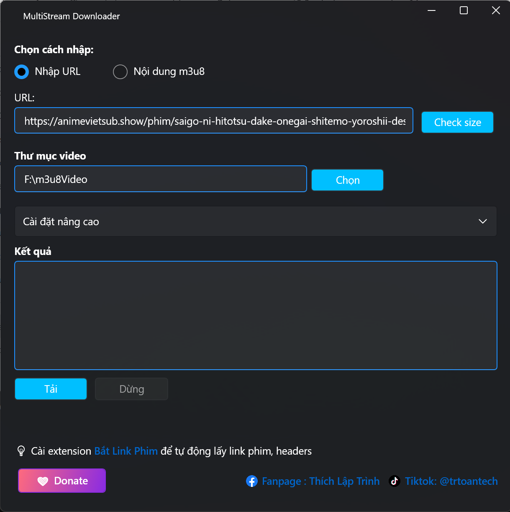

# M3U8 Downloader

A modern Windows desktop application for downloading M3U8 video streams with an intuitive WPF interface.

## What's New in v1.1.0

- 🆕 **Support for downloading animevietsub movies** (automatic link extraction, token handling, anti-bot bypass)
- 🆕 **Input raw M3U8 content** for direct download
- 🆕 **Advanced setting:** configurable M3U8 conversion batch size (number of parallel conversion threads)
- 🔄 Minor improvements and dependency updates

## Features

- 🎥 Download M3U8/MP4 video streams
- 🖥️ Modern WPF UI with WPF-UI framework
- ⚡ Built with .NET 8.0 for optimal performance
- 🎨 Beautiful and responsive user interface
- 🛡️ Cross-platform compatibility (Windows 10/11)
- 📦 Self-contained executable (no additional dependencies required)
- 📝 Support for custom headers and download paths
- 📊 Real-time download progress tracking
- ❌ Error handling and user feedback

## Screenshots

## System Requirements

- Windows 10/11 (64-bit)
- No additional dependencies required (self-contained)

## Installation
1. Go to the [Releases](https://github.com/Akai1Shuichi/m3u8downloader/releases) page
2. Download the latest `m3u8Downloader-v1.1.0.zip` file
3. Extract the ZIP file to your desired location
4. Run `m3u8Downloader.exe`
5. (Optional) Create a shortcut or pin the app to the Taskbar or Start Menu for quicker access.

## Usage
1. Launch the application
2. Paste your M3U8 URL or raw M3U8 content into the input field
3. Choose your download location
4. (Optional) Adjust advanced settings as needed (e.g., batch size)
5. Click the download button
6. Wait for the download to complete

For more details, see the [Changelog](CHANGELOG.md).